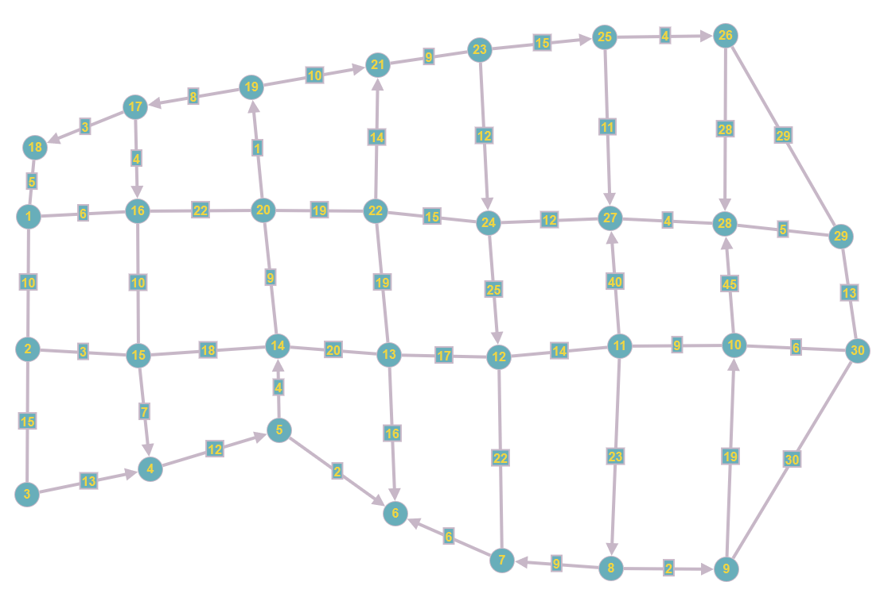

# Proyecto de Rutas con Dijkstra

Este proyecto implementa un algoritmo para encontrar el camino más corto en un grafo ponderado no dirigido utilizando el algoritmo de Dijkstra, incluyendo una función adicional en donde se puede hacer la simulacion de trancones o accidentes pudiendo cambiar el tiempo de recorrido en dicha ruta.
<center>

## El grafo se encuentra en GraphOnline, el link es el siguiente:
```
    https://graphonline.top/es/?graph=sRsJqjwQNHoianof
```
Preview:



Basado en parte del barrio La Victoria, Bucaramanga


</center>


## Archivos involucrados

### 1. **main.py**
Este archivo es el punto de entrada principal del programa. Su función principal es gestionar la interacción con el usuario a través de un menú y cargar el grafo de adyacencia para que el algoritmo de Dijkstra pueda encontrar el camino más corto entre dos nodos.

#### Descripción general:
- Se importa la función `main_menu` desde el módulo `functions.menu`.
- Se define una matriz de adyacencia de 30x30 que representa el grafo.
- El programa ejecuta la función `main_menu(graph)` para iniciar la interacción con el usuario.

### 2. **functions/dijkstra.py**
Este archivo contiene la implementación del algoritmo de Dijkstra, que es utilizado para encontrar el camino más corto entre dos nodos en un grafo ponderado.

#### Descripción general:
- **Algoritmo de Dijkstra**: Este algoritmo encuentra el camino más corto desde un nodo de inicio a un nodo final en un grafo, considerando las ponderaciones de las aristas.
- Utiliza una cola de prioridad (`heapq` en Python) para mantener los nodos visitados y procesarlos en orden de la distancia acumulada más corta.
- La función `dijkstra(graph, start, end)` recibe un grafo, el nodo de inicio y el nodo final, y devuelve el camino más corto y la distancia total.

#### Funciones:
- `dijkstra(graph, start, end)`: Implementa el algoritmo de Dijkstra y devuelve el camino más corto y la distancia.

**Explicación del algoritmo**:
1. Inicializa la distancia a todos los nodos como infinito, excepto el nodo de inicio, cuya distancia es 0.
2. Utiliza una cola de prioridad para procesar los nodos en orden de distancia acumulada más corta.
3. Para cada nodo, actualiza las distancias a sus nodos vecinos si se encuentra un camino más corto.
4. Devuelve el camino más corto y la distancia total desde el nodo de inicio al nodo final.

#### Explicación de la línea `current_distance, current_node = heapq.heappop(priority_queue)`:

La línea `current_distance, current_node = heapq.heappop(priority_queue)` utiliza la función `heappop` de la biblioteca `heapq` para extraer el nodo con la menor distancia acumulada de la cola de prioridad (`priority_queue`). La cola de prioridad mantiene los nodos ordenados según su distancia acumulada, y `heappop` garantiza que el nodo con la menor distancia sea procesado en primer lugar.

**Ejemplo:**
Supongamos que tenemos la siguiente cola de prioridad:

```plaintext
[(0, 0), (10, 1), (20, 2)]
```

**Ejemplo de cómo se almacenan los datos en las listas:**

En el algoritmo de Dijkstra, se utilizan varias listas para mantener la información de las distancias, la cola de prioridad y los nodos anteriores. A continuación, se explica cómo se almacenan los datos en cada una de ellas:

   1. distances: Lista que almacena las distancias acumuladas desde el nodo de inicio hasta cada nodo en el grafo.
   2. Inicialización: distances = [float('inf')] * n (todas las distancias se inician como infinito).
   3. Después de actualizar el nodo de inicio: distances[start] = 0.

Ejemplo para un grafo con 5 nodos y nodo de inicio 0:
```plaintext
distances = [0, inf, inf, inf, inf]
```
priority_queue: Cola de prioridad que almacena los nodos que deben ser procesados, ordenados por su distancia acumulada más corta.
```plaintext
Inicialización: priority_queue = [(0, start)] (inicia con el nodo de inicio con distancia 0).
```
Ejemplo con nodo de inicio 0:
```
priority_queue = [(0, 0)]
```
previous_nodes: Lista que mantiene el nodo anterior para reconstruir el camino más corto.

    Inicialización: previous_nodes = [-1] * n (todos los nodos iniciales no tienen nodos previos asignados).

Ejemplo para un grafo con 5 nodos:

    previous_nodes = [-1, -1, -1, -1, -1]

A medida que se ejecuta el algoritmo, estas listas se actualizan para reflejar las distancias más cortas, los nodos visitados y los nodos previos en el camino más corto.


### 3. **functions/menu.py**
Este archivo gestiona la interfaz de usuario del programa, permitiendo al usuario elegir las opciones que desea ejecutar, como buscar el camino más corto entre dos nodos.

#### Descripción general:
- Presenta un menú al usuario para que elija el nodo de inicio y el nodo final entre los disponibles en el grafo.
- Llama a la función `dijkstra` para obtener y mostrar el camino más corto y la distancia.

#### Funciones:
- `main_menu(graph)`: Muestra el menú de opciones al usuario y llama a la función `dijkstra` para resolver el problema de los caminos más cortos.

---

### Ejemplo de ejecución
Para ver un ejemplo de cómo funciona el programa, primero debes ejecutar el archivo `main.py`. Este archivo muestra un menú donde puedes seleccionar el nodo de inicio y el nodo final. El algoritmo de Dijkstra calculará el camino más corto entre esos dos nodos y te devolverá la distancia total y el recorrido.

#### Estructura general de un grafo:
El grafo está representado por una matriz de adyacencia. En esta matriz, un valor distinto de cero en la posición `[i][j]` indica que hay una arista entre el nodo `i` y el nodo `j`, y el valor representa el peso o la distancia de esa arista.

```plaintext
Grafo (ejemplo de 5 nodos):
[
    [0, 10, 0, 0, 0],
    [10, 0, 15, 0, 0],
    [0, 15, 0, 13, 0],
    [0, 0, 13, 0, 12],
    [0, 0, 0, 12, 0]
]
```